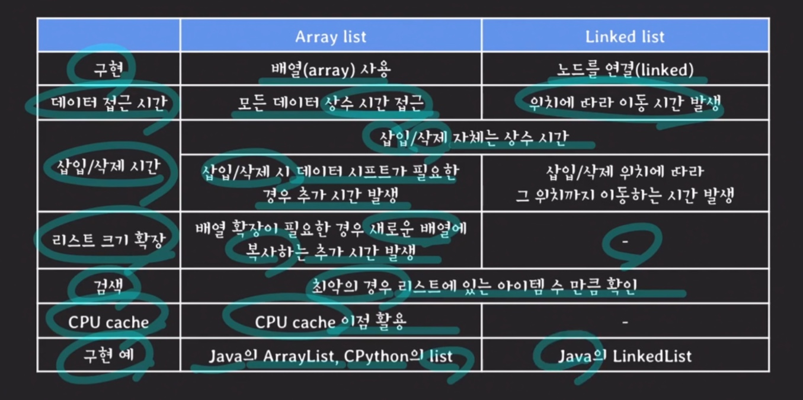

# List는 언제 쓰이는가  
  - 굳이 예시를 들자면, **'일반적으로 사용되는 프로그래밍의 순위'** 등에 쓰일 수 있다.  
  - Set이나 Map을 사용하는 게 더 적절한 상황이 아니라면, 거의 대부분 List를 사용한다고 봐도 무방하다.  
  - List의 구현체는 크게 **Array List**와 **Linked List**로 구분된다.  
    
# 배열(Array)을 사용하여 List를 구현할 경우  

  - 연속적인 공간에 메모리를 저장한다.  
  - 즉, 배열의 확장이 필요하면, 새로운 배열이 생기고, 앞의 것을 복사한다.  
  - 뭔든지 간에 앞에서부터 수행을 시작함.  
    
# Linked Lisk  
  - 노드를 연결(Linked)시키는 형태로 구현한다. (이때, '노드'는 보통 '네트워크에서 데이터의 지점'을 의미한다.)  
  - **Head**는 Linked List의 첫 번째 노드를, **Tail**은 Linked List의 마지막 노드를 의미한다.  
  - 각 포인트들이 다음의 노드를 가리키는 형태로 관리된다.  

# Linked List의 확장 팩들  
  - **Circular Linked List**: tail의 next가 head를 의미한다. 즉, tail을 관리하는 것만으로 head에 접근 가능하다.  
  - **Doubly Linked List**: 어느 위치에서는 양방향으로 접근 가능하다.  
  - **Circular Doubly Linked List**: 양방향 통행도 가능하고, tail의 next가 head다.  
  # Array List와 Linked List의 비교표  

  
