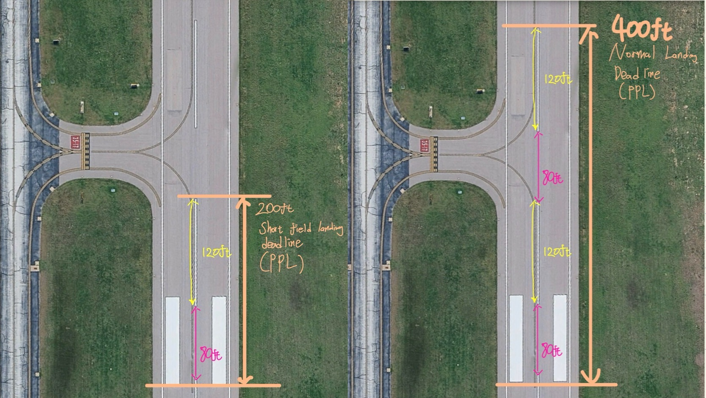

### Takeoff and Initial Navigation Practice
Takeoff

The flight began with a normal takeoff from the runway.

비행은 활주로에서 normal takeoff로 시작했다.

After takeoff, the next step was to brief the navigation plan and select the first waypoint.

이륙 후에는 바로 항법 계획을 브리핑하고 첫 번째 웨이포인트를 설정했다.

### Waypoint and Navigation Briefing

During the climb, a waypoint was selected and the heading and altitude plan were briefed.

상승 중 웨이포인트를 설정하고, 목표 헤딩과 고도에 대한 브리핑을 진행했다.

The plan included using nearby VOR/DME stations for navigation.

이번 계획에는 근처의 VOR/DME 항법 시설을 이용한 항법 추적이 포함되어 있었다.

First, the VOR/DME frequencies were set for nearby stations such as TTT (113.1) and Ranger (115.7).

먼저 TTT(113.1)와 Ranger(115.7) 같은 주변 VOR/DME 주파수를 설정했다.

Setting the correct frequency allows the pilot to receive the navigation signal and distance information.

올바른 주파수를 설정하면 항법 신호와 거리 정보를 수신할 수 있다.

### Identifying the VOR

After tuning the VOR frequency, the next step was to identify the station.

VOR 주파수를 맞춘 후 다음 단계는 해당 항법시설을 식별하는 것이다.

Pilots identify a VOR by listening to its Morse code identifier or voice identification.

조종사는 모스 부호 식별 신호나 음성 식별 신호를 통해 VOR을 확인한다.

The Morse code corresponds to the three-letter identifier of the station.

이 모스 부호는 해당 항법시설의 세 글자 식별 코드에 해당한다.

This step confirms that the correct navigation station is being used.

이 과정은 올바른 항법시설을 사용하고 있는지 확인하기 위한 단계이다.

⚠️ This identification step must always be completed before using the VOR for navigation.

⚠️ VOR을 항법에 사용하기 전에 반드시 식별 과정을 수행해야 한다.

### Position Briefing

After identifying the station, the next step was to brief the aircraft’s current position relative to the VOR.

VOR을 식별한 후에는 해당 스테이션 기준으로 현재 항공기의 위치를 브리핑했다.

This includes determining which radial the aircraft is on and estimating the distance from the station using DME.

여기에는 항공기가 어떤 radial 위에 있는지와 DME를 이용해 스테이션까지의 거리를 파악하는 과정이 포함된다.

For example, the position can be described relative to the station such as north, south, east, or west of the VOR.

예를 들어 VOR 기준으로 북쪽, 남쪽, 동쪽, 서쪽 어느 방향에 위치해 있는지 설명할 수 있다.

Knowing the current position helps confirm that the navigation plan and heading are correct.

현재 위치를 정확히 파악하면 항법 계획과 헤딩이 올바른지 확인할 수 있다.

This preparation makes it easier to continue navigation and execute the planned route.

이러한 준비는 이후 항법을 수행하고 계획된 경로를 따라 비행하는 데 도움이 된다.

### Identifying VOR

<iframe width="100%" height="468"
src="https://www.youtube.com/embed/xY3Wamz9XgI"
title="YouTube video player"
frameborder="0"
allowfullscreen>
</iframe>

### Unusual Attitude Practice

After completing the navigation setup, the flight continued with unusual attitude practice.

항법 설정을 마친 후에는 unusual attitude 연습으로 이어졌다.

This exercise focuses on recognizing and recovering from unusual aircraft attitudes.

이 훈련은 항공기의 비정상적인 자세를 인식하고 회복하는 능력을 연습하는 데 목적이 있다.

⚠️ During the recovery, pitch correction and leveling the wings must be performed simultaneously.

⚠️ 회복 과정에서는 pitch 교정과 wings level 조작을 반드시 동시에 수행해야 한다.

⚠️ Failing to correct pitch and wings level simultaneously can easily lead to a failure.

⚠️ pitch와 wings level을 동시에 교정하지 않으면 충분히 Fail 사유가 될 수 있다.

### Bad Nose down unusual altitude Recovery
<iframe width="100%" height="468"
src="https://www.youtube.com/embed/5s5pVHcMFLk"
title="YouTube video player"
frameborder="0"
allowfullscreen>
</iframe>

### Better Nose down unusual altitude Recovery

<iframe width="100%" height="468"
src="https://www.youtube.com/embed/R9lYyCTxytw"
title="YouTube video player"
frameborder="0"
allowfullscreen>
</iframe>

### Better Nose High unusual altitude Recovery

<iframe width="100%" height="468"
src="https://www.youtube.com/embed/bPsffy90czk"
title="YouTube video player"
frameborder="0"
allowfullscreen>
</iframe>

Diversion and Maneuver Practice

Diversion During Cross-Country Flight

While flying the cross-country plan, a diversion was introduced during the flight.

크로스컨트리 계획대로 비행하던 중, 중간에 diversion 상황이 주어졌다.

As soon as the diversion instruction was given, the first step was to immediately listen to the ATIS, ASOS, or AWOS and write down the information.

diversion 지시를 받으면 가장 먼저 해야 할 것은 바로 ATIS, ASOS 또는 AWOS를 듣고 정보를 적어두는 것이다.

At the same time, it is also important to set up the communication radios in advance.

이와 동시에 통신 라디오도 미리 설정해 두는 것이 중요하다.

This includes tuning the appropriate frequencies on COMM 1 and COMM 2 for the diversion airport.

여기에는 diversion 공항에 맞는 주파수를 COMM 1과 COMM 2에 미리 설정하는 것이 포함된다.

Preparing the radios early helps reduce workload when approaching the airport later.

라디오를 미리 준비해 두면 이후 공항에 접근할 때 작업량을 줄일 수 있다.

During the diversion, several flight maneuvers are often practiced while flying toward the diversion airport.

diversion 공항으로 이동하는 동안 여러 가지 비행 기동들이 함께 진행되는 경우가 많다.

Because of this, the workload can increase significantly while performing the maneuvers.

이 때문에 기동을 수행하는 동안 조종사의 작업량이 크게 증가할 수 있다.

If the weather information is not gathered immediately, it is easy to forget about it while focusing on the maneuvers.

기상 정보를 바로 확인하지 않으면 기동에 집중하는 과정에서 이를 놓치기 쉽다.

By the time the maneuvers are completed, the aircraft may already be very close to the diversion airport.

기동이 끝날 즈음에는 항공기가 이미 diversion 공항에 상당히 가까워져 있을 수 있다.

This can create unnecessary pressure and confusion during the approach phase.

이 상황은 어프로치 과정에서 불필요한 부담과 당황스러움을 만들 수 있다.

These included slow flight, power-off stalls, and power-on stalls.

여기에는 slow flight, power-off stall, 그리고 power-on stall이 포함되었다.

Especially during the power-on stall, the power setting must be sufficiently high.

특히 **power-on stall**을 수행할 때는 충분한 파워 설정이 필요하다.

If the power is only around 65 percent, the maneuver will usually need to be repeated with full power.

파워가 약 65% 정도만 들어가면 보통 다시 full power로 수행하라는 지시를 받게 된다.

**Steep Turns**

Steep turns were also practiced during the flight.

비행 중 steep turn 기동도 수행했다.

This maneuver requires maintaining altitude within ±100 feet and airspeed within ±10 knots.

이 기동에서는 고도 ±100피트, 속도 ±10노트 이내로 유지해야 한다.

Because the tolerances are strict, it is important to monitor both outside references and the flight instruments carefully.

허용 오차가 매우 엄격하기 때문에 외부 기준과 계기를 모두 주의 깊게 확인해야 한다.

At times, focusing more on the instruments can help maintain stable performance during the maneuver.

경우에 따라서는 계기를 더 집중해서 보는 것이 기동을 안정적으로 유지하는 데 도움이 될 수 있다.

Emergency Landing Practice

An emergency landing scenario was also introduced around 3,500 feet.

약 3,500피트 고도에서 emergency landing 상황도 연습했다.

In this situation, it is very helpful to already know the emergency checklist by memory.

이 상황에서는 비상 체크리스트를 이미 숙지하고 있는 것이 큰 도움이 된다.

While the checklist should still be referenced formally, relying on memory helps maintain situational awareness and saves time.

형식적으로 체크리스트를 확인하는 것은 필요하지만, 절차를 외워두면 상황 인식과 시간 관리에 훨씬 유리하다.

At lower altitudes, selecting the best landing spot in an open field can take more time than expected.

고도가 낮은 상황에서는 open field에서 가장 적절한 착륙 지점을 찾는 데 생각보다 시간이 더 걸릴 수 있다.

Because of this, it is important to practice the procedure enough so that the steps come out naturally from memory.

따라서 절차가 자연스럽게 기억에서 나올 수 있도록 충분히 연습하는 것이 중요하다.

The checklist should still be opened, but rather than trying to read every item, it is often better to let the memorized procedure guide the actions.

체크리스트는 형식적으로 펼쳐 두는 것이 좋지만, 모든 항목을 읽으려 하기보다는 암기한 절차가 자연스럽게 나오도록 하는 것이 더 중요하다.

Wind direction should also be considered when planning the landing pattern.

착륙 패턴을 계획할 때는 바람 방향도 반드시 고려해야 한다.

This includes planning the downwind entry and preparing for a potential headwind landing.

다운윈드 진입과 헤드윈드 착륙 가능성까지 고려하는 것이 중요하다.

**Turns Around a Point**

Turns around a point was another maneuver practiced during the flight.

turns around a point 기동도 수행했다.

During this maneuver, altitude should be maintained within ±100 feet and airspeed within ±10 knots.

이 기동에서도 고도 ±100피트, 속도 ±10노트를 유지해야 한다.

Maintaining consistent altitude while adjusting for wind drift is the key challenge of this maneuver.

바람에 따른 드리프트를 보정하면서 일정한 고도를 유지하는 것이 핵심이다.

**Preparing for the Diversion Airport**

Before flying, it is helpful to study the taxiways and airport layout of potential diversion airports.

비행 전에 diversion 가능성이 있는 공항의 택시웨이와 공항 구조를 미리 확인해 두는 것이 좋다.

Tools such as Google Earth can be useful for visualizing the airport environment.

Google Earth 같은 도구를 활용하면 공항 환경을 미리 파악하는 데 도움이 된다.

This preparation helps avoid confusion about which taxiway to exit after landing.

이런 준비는 착륙 후 어느 택시웨이로 빠져나갈지 혼란스러워지는 상황을 방지해 준다.

Even exiting at a slightly farther taxiway is usually acceptable if it keeps the situation safe and organized.

조금 더 먼 택시웨이로 빠지는 경우라도 안전하고 안정적인 상황을 유지할 수 있다면 보통 문제가 되지 않는다.

**Pattern Planning with ForeFlight**

If a potential diversion airport is expected, it can help to mark a downwind entry point in ForeFlight before the flight.

diversion 가능성이 있는 공항이 있다면 출발 전에 ForeFlight에서 다운윈드 진입 지점을 표시해 두는 것도 도움이 된다.

Placing the entry point about one mile from the runway can make pattern entry much easier.

활주로에서 약 1마일 정도 떨어진 지점을 표시해 두면 패턴 진입이 훨씬 수월해진다.

**Practicing Landings Without PAPI**

Practicing landings at airports without PAPI can also be very useful.

PAPI가 없는 공항에서 착륙 연습을 하는 것도 매우 도움이 된다.

Without visual glide path guidance, pilots must rely more on sight picture and judgment.

시각적인 글라이드 패스 지시가 없기 때문에 조종사는 시각적 판단에 더 의존해야 한다.

Learning to judge the correct glide path without PAPI improves overall landing awareness.

PAPI 없이도 적절한 글라이드 패스를 판단하는 능력은 착륙 감각을 크게 향상시킨다.

During evaluations or diversion scenarios, the selected airport may often not have a PAPI system installed.

평가 상황이나 diversion 상황에서 선택되는 공항은 PAPI가 설치되어 있지 않은 경우가 상당히 많다.

Because of this, pilots should be comfortable judging the glide path using outside visual references alone.

따라서 조종사는 외부 시각 기준만으로 글라이드 패스를 판단하는 데 익숙해져 있어야 한다.

For example, practicing touch-and-go operations at airports like Hicks can be helpful in developing this skill.

예를 들어 Hicks 같은 공항에서 터치앤고 연습을 하는 것도 이러한 능력을 기르는 데 도움이 될 수 있다.

**Landing Sequence at the Diversion Airport**

**Forward Slip Demonstration**

After arriving at the diversion airport, the first maneuver practiced was a forward slip during the approach.

diversion 공항에 도착한 후 첫 번째로 수행한 것은 어프로치 중 forward slip 기동이었다.

Trying to approach from an excessively high altitude just to demonstrate a dramatic forward slip is usually not recommended.

forward slip을 보여주기 위해 일부러 지나치게 높은 고도에서 드라마틱하게 접근하는 것은 좋은 방법이 아니다.

Instead, it is often better to remain on a normal glide path and simply demonstrate the slip briefly when requested.

대신 정상적인 글라이드 패스를 유지한 상태에서 요청이 있을 때 짧게 보여주는 것이 더 좋다.

A short demonstration of around five seconds is usually enough to show proper control of the maneuver.

약 5초 정도 간단히 보여주는 것만으로도 기동을 충분히 설명할 수 있다.

Over-emphasizing the maneuver from a high approach can create unnecessary risk during the landing.

과도하게 높은 접근에서 slip을 강조하려 하면 착륙 과정에서 불필요한 위험이 생길 수 있다.

### Normal Landing and Taxi Back

After the forward slip demonstration, a normal landing was performed followed by a full stop.

forward slip 시연 후 normal landing을 수행하고 full stop으로 착륙했다.

After landing, the aircraft taxied back for the next departure.

착륙 후 다음 이륙을 위해 taxi back을 진행했다.

**Soft Field Takeoff and Landing**

For the second departure, a soft field takeoff was performed.

두 번째 이륙에서는 soft field takeoff를 수행했다.

After takeoff, the aircraft returned for a soft field landing.

이륙 후 다시 돌아와 soft field landing을 수행했다.

Although soft field landings have relatively flexible touchdown requirements during basic training, it is still recommended to aim for the 1000-foot markers.

soft field landing은 기본 훈련 단계에서는 비교적 관대한 접지 기준을 가지고 있지만, 1000-foot marker를 목표로 연습하는 것이 좋다.

For this maneuver, the primary requirement is that the touchdown occurs after the beginning of the 1000-foot markers rather than before them.

이 기동에서는 접지가 1000-foot marker의 시작점 이전이 아니라 그 이후에서 이루어지는 것이 주요 기준이 된다.

Touching down before the markers can indicate that the aircraft was too low on the approach and may be considered unsatisfactory during an evaluation.

마커 이전에 접지하는 것은 어프로치가 너무 낮았다는 의미가 될 수 있으며, 평가 상황에서는 기준을 충족하지 못한 것으로 판단될 수 있다.

Using the 1000-foot markers as a reference helps maintain a more stable and predictable approach path.

1000-foot marker를 기준으로 삼으면 보다 안정적인 어프로치를 유지하는 데 도움이 된다.

In the commercial training stage, pilots are often expected to land much closer to the 1000-foot marker, so practicing this early can be beneficial.

Commercial 단계에서는 1000-foot marker 근처에 정확히 접지해야 하는 경우가 많기 때문에, 미리 이러한 기준을 염두에 두고 연습하는 것도 도움이 된다.

After landing, the aircraft taxied back again for the next departure.

착륙 후 다시 taxi back을 진행했다.

**Short Field Takeoff and Return Flight**

The third departure was a short field takeoff.

세 번째 이륙은 short field takeoff로 진행했다.

After departure, the flight continued back toward Meacham Airport (KFTW).

이륙 후 Meacham Airport(KFTW)로 복귀 비행을 진행했다.

Final Short Field Landing at Meacham

The final landing of the flight was a short field landing at Meacham.

비행의 마지막 착륙은 Meacham에서 short field landing이었다.

When performing this maneuver, it is easy to focus too much on the 50-foot obstacle requirement and approach too high.

이 기동에서는 50-foot obstacle을 지나야 한다는 점에 너무 집중하면 접근 고도가 지나치게 높아질 수 있다.

The video below shows an approach that was approximately 100 feet higher than the normal glide path.

아래 영상은 평소 글라이드 패스보다 약 100피트 더 높은 상태에서 접근한 경우를 보여준다.

This type of approach is usually considered unstable.

이런 유형의 어프로치는 보통 불안정하다고 간주된다.

### Bad Short field Approach (Too high)
<iframe width="100%" height="468"
src="https://www.youtube.com/embed/UKT1qhPpSGg"
title="YouTube video player"
frameborder="0"
allowfullscreen>
</iframe>

A stable approach on the proper glide path is usually more important than attempting a dramatic steep descent.
드라마틱하게 급격한 하강을 시도하기보다 안정적인 글라이드 패스를 유지하는 것이 훨씬 중요하다.

At runway 16, the PAPI system uses four lights: two white and two red indicate the correct glide path.

활주로 16에서는 PAPI가 네 개의 라이트로 구성되어 있으며, 두 개의 흰색과 두 개의 빨간색이 정상적인 글라이드 패스를 의미한다.

Being familiar with this visual reference helps maintain a stable approach.

이 시각적 기준을 숙지하면 안정적인 어프로치를 유지하는 데 도움이 된다.

However, if a pilot is more accustomed to runways with fewer visual glide path lights—such as runways 17 or 35—it is important not to be surprised when encountering a different PAPI configuration.

하지만 평소 활주로 17이나 35처럼 PAPI 라이트 수가 적은 환경에 익숙해져 있었다고 해서, 다른 구성의 PAPI를 보게 되었을 때 당황할 필요는 없다.

Different runway lighting configurations are common, and pilots should be prepared to interpret them calmly.

활주로마다 조명 구성이 다른 것은 충분히 발생할 수 있는 일이므로 침착하게 해석하는 것이 중요하다.

**Landing Accuracy and Go-Around Decision**

Landing accuracy is one of the most important parts of the flight.

착륙 정확도는 비행에서 매우 중요한 부분이다.

It is better to perform a go-around if the approach becomes unstable rather than forcing the landing.

어프로치가 불안정해지면 착륙을 억지로 시도하기보다 go-around를 수행하는 것이 훨씬 안전하다.

Practicing go-around decisions during normal training flights can help develop better judgment in real situations.

평소 훈련 비행에서 go-around 판단을 연습해 두면 실제 상황에서 훨씬 자연스럽게 대응할 수 있다.

Developing the instinct to go around when needed is an important part of landing training.

필요할 때 go-around를 선택하는 본능적인 판단 능력은 착륙 훈련에서 매우 중요한 요소이다.

If it becomes clear that the aircraft will not reach the desired touchdown point for that type of landing, performing a go-around is the better option.

해당 착륙 종류에서 원하는 접지 지점에 도달하기 어렵다고 판단되면 go-around를 수행하는 것이 더 나은 선택이다.

It can help to approach the situation calmly with the mindset that there are usually multiple opportunities to perform the landing correctly.

보통 한 번의 시도만 있는 것이 아니기 때문에 침착하게 상황을 바라보는 마음가짐이 도움이 된다.

In many cases, having the mindset that there are up to three attempts available can reduce unnecessary pressure during the approach.

대부분의 경우 최대 세 번 정도의 기회가 있다고 생각하면 어프로치 중 불필요한 압박을 줄일 수 있다.

No one is forcing the landing, and maintaining safety and stability should always be the priority.

누구도 착륙을 억지로 강요하지 않으며, 항상 안전과 안정적인 비행이 최우선이어야 한다.

**Landing Technique and Power Management**

Power Management During the Flare

During landing practice, power management during the round-out and flare made a noticeable difference.

착륙 연습 중 라운드 아웃과 플레어에서의 파워 관리가 큰 차이를 만들었다.

On the first attempt, the power was reduced to idle early, and small power adjustments were used to try to reach the 1000-foot aiming point.

첫 번째 시도에서는 파워를 일찍 idle로 줄인 뒤 1000-foot 에이밍 포인트에 맞추기 위해 파워를 조금씩 조절했다.

However, frequently adding and reducing power during the flare did not seem to produce a stable approach.

하지만 플레어 과정에서 파워를 계속 넣고 빼는 방식은 안정적인 어프로치로 보이지 않았다.

This type of throttle movement can also be viewed negatively during an evaluation because it suggests an unstable approach.

이와 같은 파워 조작 방식은 어프로치가 불안정하다는 인상을 줄 수 있기 때문에 평가 상황에서도 좋지 않게 보일 수 있다.

Maintaining a stable approach with minimal throttle changes is generally preferred.

가능한 한 파워 조작을 최소화하면서 안정적인 어프로치를 유지하는 것이 더 바람직하다.

On the next attempt, the approach was handled differently.

다음 시도에서는 접근 방식을 조금 바꾸었다.

Instead of pulling the power completely to idle early, about 10 percent power was maintained while crossing the runway numbers.

활주로 번호 위를 지날 때 파워를 완전히 idle로 줄이지 않고 약 10% 정도 남겨 두었다.

This allowed small adjustments based on wind conditions without disrupting the approach.

이 방식은 바람 상황에 맞게 작은 조정을 하면서도 어프로치를 안정적으로 유지할 수 있게 해주었다.

Then, near the aiming point—around the second stripe near the 1000-foot marker—the power was smoothly reduced to idle and the round-out began.

그 후 에이밍 포인트인 1000-foot marker 근처의 두 번째 스트라이프 지점에서 파워를 부드럽게 idle로 줄이며 라운드 아웃을 시작했다.

The sink rate stabilized and the touchdown occurred very close to the intended point.

하강률이 안정되었고 목표 지점에 매우 가깝게 접지할 수 있었다.

This approach worked much better than continuously adjusting the throttle during the flare.

이 방식은 플레어 중 파워를 계속 조정하는 것보다 훨씬 안정적으로 작동했다.

### Good Short Field Approach Videos
<iframe width="100%" height="468"
src="https://www.youtube.com/embed/D35_tpZG9pk"
title="YouTube video player"
frameborder="0"
allowfullscreen>
</iframe>

Maintaining a stable approach and avoiding excessive throttle movement appears to be an important part of landing accuracy.

안정적인 어프로치를 유지하고 파워를 과하게 조작하지 않는 것이 정확한 착륙에 중요한 요소로 보였다.

**Note About Flight Data Visualization**

One additional note relates to the flight track shown in CloudAhoy.

CloudAhoy에 표시된 비행 경로에 대해서도 한 가지 참고할 점이 있다.

In the data visualization, the aircraft may appear slightly offset from the runway centerline.

데이터 화면에서는 항공기가 활주로 센터라인에서 약간 벗어난 것처럼 보일 수 있다.

This can happen if the Sentry device is mounted on the left window, which shifts the recorded GPS position slightly to the left.

이는 Sentry 장비가 왼쪽 창문에 장착되어 있을 경우 GPS 위치가 약간 왼쪽으로 치우쳐 기록될 수 있기 때문이다.

As a result, the recorded track may not perfectly represent the actual centerline alignment during landing.

그 결과 실제 착륙 시의 센터라인 정렬과 기록된 데이터 사이에 약간의 차이가 생길 수 있다.